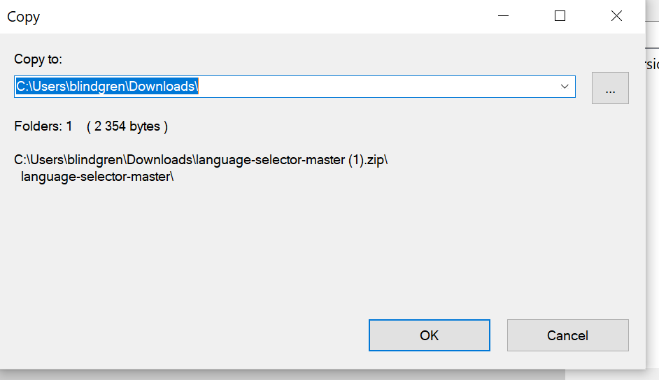

# Mr Roboger's Neighborhood

#### A fun applicationt that plays with words and numbers! - Independent Project for Epicodus, 06.012.2020

## By Brittany Lindgren

## Description

Have you ever wanted to speak to a Robot? Well today's your lucky day! As you probably know, Robots speak in beeps, boops and numbers. Enter a number into the form, submit it, and see how the robot responds. 

## Setup/Installation Requirements

1. Follow this [link to the project repository](https://github.com/LINDGRENBA/mr-roboger-FT) on GitHub.

2. Click on the "Clone or download" button to copy the project link.
 

3. If you are comfortable with the command line, you can copy the project link and clone it through your commad line with the command `git clone`. Otherwise, I recommend choosing "**Download ZIP**". 

4. Once the ZIP file has finished downloading, you can right click on the file to view the zip folder in your downloads. 

5. Right click on the project ZIP folder that you have just downloaded and choose the option "**Copy To...**", then choose the location where you would like to save this folder. 

6. Navigate to the final location where you have chosen to save the project folder.

7. To view the code itself, right click, choose "open with..." and open using a text editor such as VS Code or Atom, etc.

#### Additional Setup/Installation Notes:

* You do not need to run a server to view this document.

* No additional code is necessary to view this project.   

## Specifications

#### Behavior: The program will take in a number and return a range of numbers from 0 to that number.
* Input: 5
* Output: 0, 1, 2, 3, 4, 5

#### Behavior: If the number contains a 1, all digits will be replaced with "Beep!"
* Input: 1, 11, 13
* Output: "Beep!", "Beep!", "Beep!"

#### Behavior: If the number contains a 2, all digits will be replaced with "Boop!". 2 will take precedence over 1.
* Input: 2, 21
* Output: "Boop!", "Boop!"

#### Behavior: If the number contains a 3, all digits will be replaced with "Won't you be my neighbor?". 3 will take precedence over 2.
* Input: 13, 32
* Output: "Won't you be my neighbor?", "Won't you be my neighbor?"

#### Behavior: Program will reverse order of output from highest number to 0.
* Input: 5
* Output: 5, 4, "Won't you be my neighbor?", "Boop!", "Beep!", 0

#### Behavior: Program will add user name to "Won't you be my neighbor?"
* Input: Beatrice + 3
* Output: 0, "Beep!", "Boop!", "Won't you be my neighbor, Beatrice?

#### Behavior: Program will add user name to "Won't you be my neighbor?" only if number is divisible by 3, with exception of 0.
* Input: Beatrice + 13
* Output: 0, "Beep!", "Boop!", "Won't you be my neighbor, Beatrice?", 4, 5, "Won't you be my neighbor, Beatrice?" .... "Won't you be my neighbor?"

## Known Bugs

#### Not Yet Resolved
* Reverse-output does not disappear when user enters new input

#### Resolved
* N/A

## User Interface, To Resolve

#### Not Yet Resolved
* Rows do not resize when viewport becomes smaller
* When user selects 'Reverse The Order!' button, div showing user number displays NaN
* When user enters new number, .highlight class remains on output-reverse, does not return to output

#### Resolved
* Issues with alignment of image and other divs with using grid-column and grid-row (resolved by removing img from html and adding as background with css)

## Support and contact details

Please feel free to contact me through GitHub (username: LINDGRENBA) with any questions, ideas or concerns.  

## Technologies Used

* HTML5
* CSS3
* Bootstrap v-3.3.7
* JavaScript
* jQuery v-3.5.0
* Visual Studio Code 
* Git and Git BASH 

### License

*This site is licensed under the MIT license.*

Copyright (c) 2020 **_Brittany A Lindgren_**